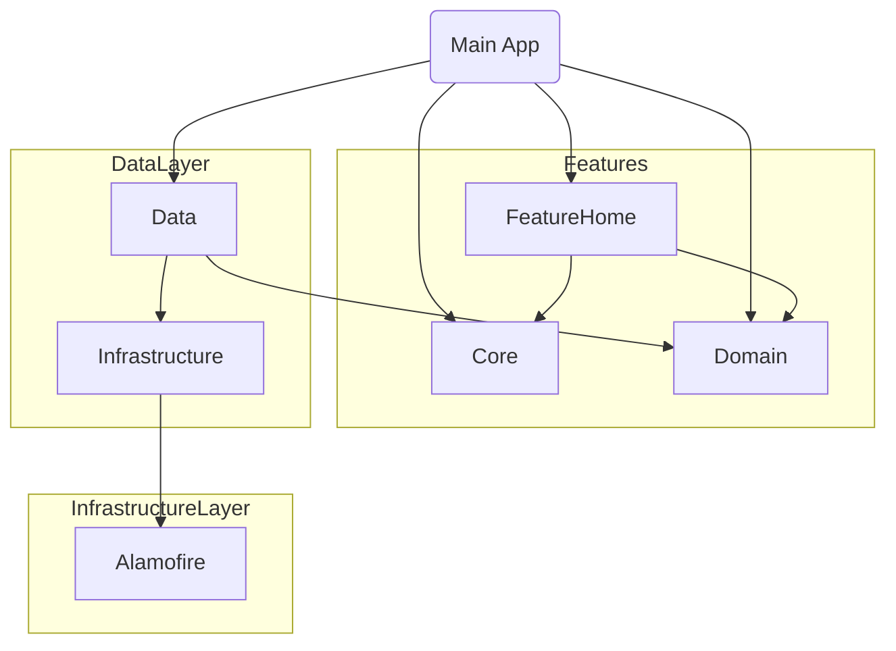

# RickAndMorty Modular Hybrid Architecture


**Modüler Mimari, MVVM-C Deseni ve Hibrit UI (UIKit + SwiftUI) entegrasyonunu gösteren, kurumsal seviyede, ölçeklenebilir bir iOS uygulaması.**

## 🎯 Proje Amacı

Bu proje, büyük ölçekli (Superapp seviyesi) mobil uygulamaların mimari standartlarını simüle etmek amacıyla geliştirilmiştir. Odak noktası **kod okunabilirliği**, **test edilebilirlik**, **ölçeklenebilirlik** ve **performans optimizasyonudur** (özellikle Uygulama Açılış Süresi).

Kod tabanı, **Swift Package Manager (SPM)** tabanlı Modüler Mimari üzerine kurulmuştur ve sorumlulukların ayrılmasını (Separation of Concerns) sağlamak için **Clean Architecture** prensiplerini sıkı bir şekilde uygular.

---

## 🏗 Mimari & Modülarite

Proje, **Modüler Mimari** kullanılarak fiziksel olarak bağımsız yerel paketlere ayrılmıştır. Derleme sürelerini ve uygulama açılış performansını optimize etmek için tüm modüller **Statik Kütüphane (.static)** olarak yapılandırılmıştır.

### Bağımlılık Grafiği (Dependency Graph)



<br>
<br>

## 📂 Project Structure

The project follows a strictly modular structure using local Swift Packages.

```text
RickAndMortyHybrid
├── Packages/                          # Modular Layers (SPM)
│   ├── Domain/                        # Pure Swift - Business Logic
│   │   ├── Sources/
│   │   │   ├── Character.swift
│   │   │   └── CharacterRepositoryProtocol.swift
│   │   └── Tests/
│   │
│   ├── Data/                          # Data Access Layer
│   │   ├── Sources/
│   │   │   ├── CharacterRepository.swift
│   │   │   └── CharactersEndpoint.swift
│   │   └── Tests/
│   │
│   ├── Infrastructure/                # Low-Level Networking & Tools
│   │   ├── Sources/
│   │   │   ├── NetworkManager.swift
│   │   │   ├── NetworkLogger.swift
│   │   │   ├── NetworkError.swift
│   │   │   ├── Endpoint.swift
│   │   │   └── NetworkTypes.swift
│   │   └── Tests/
│   │       └── InfrastructureTests.swift
│   │
│   ├── Core/                          # DI & Shared Helpers
│   │   ├── Sources/
│   │   │   ├── ServiceLocator.swift
│   │   │   ├── Inject.swift
│   │   │   └── Coordinator.swift
│   │   └── Tests/
│   │
│   └── FeatureHome/                   # UI & Presentation Layer
│       └── Sources/
│           ├── HomeView.swift
│           ├── HomeViewModel.swift
│           ├── HomeViewState.swift
│           └── CharacterDetailView.swift
│
├── RickAndMortyHybrid/                # Main Application Target
│   ├── AppConfigurator.swift          # Dependency Graph Setup
│   ├── AppCoordinator.swift           # Root Navigation Logic
│   ├── AppDelegate.swift
│   ├── SceneDelegate.swift
│   ├── Assets.xcassets
│   └── Info.plist
│
└── RickAndMortyHybridUITests/         # UI Automation Tests
    └── FeatureHomeUITests.swift       # Scroll & Navigation Tests
```

<br>
<br>

* **📱 App Target:** Sadece `AppCoordinator` ve bağımlılık konfigürasyonunu (`AppConfigurator`) içerir.
* **📦 FeatureHome:** UI (SwiftUI Görünümleri) ve Sunum Mantığını (ViewModels) içerir.
* **🧠 Domain:** Uygulamanın kalbidir. Varlıklar (Entities), Kullanım Durumları (Use Cases) ve Repository Protokollerini içeren saf Swift kodu. Dış bağımlılık içermez.
* **💾 Data:** Veri erişim katmanıdır. Repository implementasyonlarını içerir ve veri getirme stratejilerini yönetir.
* **🛠 Infrastructure:** Düşük seviyeli ağ işlemleri (Alamofire wrapper), loglama ve diğer çekirdek araçlar.
* **⚙️ Core:** Bağımlılık Enjeksiyonu (Service Locator), paylaşılan protokoller ve yardımcı sınıfları içerir.

---

## 🚀 Teknoloji Yığını (Tech Stack)

* **Dil:** Swift 5.9
* **Platform:** iOS 15.0+
* **UI Frameworks:** SwiftUI & UIKit (Hibrit Navigasyon Yaklaşımı)
* **Mimari:** MVVM-C (Model-View-ViewModel-Coordinator)
* **Eşzamanlılık:** Swift Async/Await (Structured Concurrency)
* **Ağ (Networking):** Alamofire (Network Facade ile sarmalanmış)
* **Bağımlılık Yönetimi:** Swift Package Manager (SPM) - Yerel Paketler
* **Test:** XCTest (Birim Testleri) & XCUITest (Arayüz Testleri)

---

## 🧩 Uygulanan Tasarım Kalıpları (Design Patterns)

Bu proje, belirli mimari zorlukları çözmek için çeşitli tasarım kalıplarını stratejik olarak kullanır:

### 1. Mimari Kalıplar (Architectural Patterns)
* **Modular Architecture:** Kod tabanını bağımsız paketlere ayırarak derleme sürelerini hızlandırma ve bağımlılıkları yönetme.
* **Clean Architecture:** Bağımlılık kuralını (Dependency Rule) içe doğru (Domain'e) yönlendirme.
* **MVVM-C:** UI mantığını (ViewModel) ve Navigasyon mantığını (Coordinator) birbirinden ayırma.

### 2. Yaratımsal Kalıplar (Creational Patterns)
* **Singleton Pattern:** Küresel konfigürasyon için tek bir örnek sağlamak amacıyla `ServiceLocator.shared` ve `AppConfigurator.shared` yapılarında kullanılmıştır.
* **Service Locator Pattern:** İstemci sınıfları, bağımlılıkların somut uygulamalarından ayırmak için kullanılmıştır.
* **Dependency Injection (DI):** Bağımlılıkları (örn. Repository) temiz bir şekilde enjekte etmek için `@Inject` Property Wrapper uygulanmıştır.

### 3. Yapısal Kalıplar (Structural Patterns)
* **Facade Pattern:** `NetworkManager` sınıfı, karmaşık Alamofire konfigürasyonunu, kodlama ve çözümleme işlemlerini basit bir API arkasında gizler.
* **Adapter Pattern:** `UIHostingController`, SwiftUI görünümlerinin UIKit `UINavigationController` yığını içinde çalışmasını sağlayan bir adaptör görevi görür.
* **Decorator Pattern:** Koda dinamik olarak davranış eklemek için `@Inject` ve `@MainActor` gibi Property Wrapper'lar kullanılmıştır.

### 4. Davranışsal Kalıplar (Behavioral Patterns)
* **Coordinator Pattern:** `AppCoordinator`, navigasyon akışını yöneterek View Controller ve View'ların hafif ve tekrar kullanılabilir kalmasını sağlar.
* **Repository Pattern:** `CharacterRepository`, veri kaynağını (API) soyutlayarak ViewModel'in verinin kökeninden habersiz olmasını sağlar.
* **Observer Pattern:** ViewModel durumunu SwiftUI Görünümüne bağlamak için `ObservableObject` ve `@Published` aracılığıyla kullanılmıştır.

---

## 🧪 Test Stratejisi

Proje, hem Birim (Unit) hem de Arayüz (UI) testleri ile güvenilirliği sağlar.

### Birim Testleri (`InfrastructureTests`, `DataTests`)
* **Mocking:** `MockURLProtocol` kullanılarak ağ istekleri yakalanır, böylece Ağ Katmanı gerçek internet bağlantısı olmadan test edilebilir.
* **İzolasyon (Isolation):** Katmanlar, bağımlılıkları mocklanarak (örn. MockRepository) izole bir şekilde test edilir.

### UI Testleri (`RickAndMortyHybridUITests`)
* **Stres Testi:** Hafıza sızıntılarını (memory leaks) ve çökme durumlarını (crashes) tespit etmek için hızlı kaydırma ve navigasyon simüle edilir.
* **Akış Doğrulama (Flow Validation):** Liste Ekranından Detay Ekranına gidiş ve geri dönüş yolculuğu **XCUITest** kullanılarak doğrulanır.

---

## 📲 Kurulum & Çalıştırma

1.  Repoyu klonlayın:
    ```bash
    git clone [https://github.com/KULLANICI_ADINIZ/RickAndMorty-Modular-MVVMC-Hybrid-UI.git](https://github.com/KULLANICI_ADINIZ/RickAndMorty-Modular-MVVMC-Hybrid-UI.git)
    ```
2.  `RickAndMortyHybrid.xcodeproj` dosyasını Xcode 15+ ile açın.
3.  Swift Package Manager'ın bağımlılıkları yüklemesini bekleyin.
4.  Bir Simülatör seçin (örn. iPhone 15 Pro) ve çalıştırın (`Cmd + R`).

---
